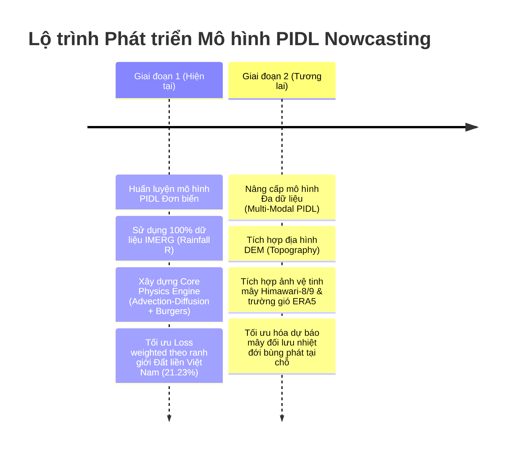
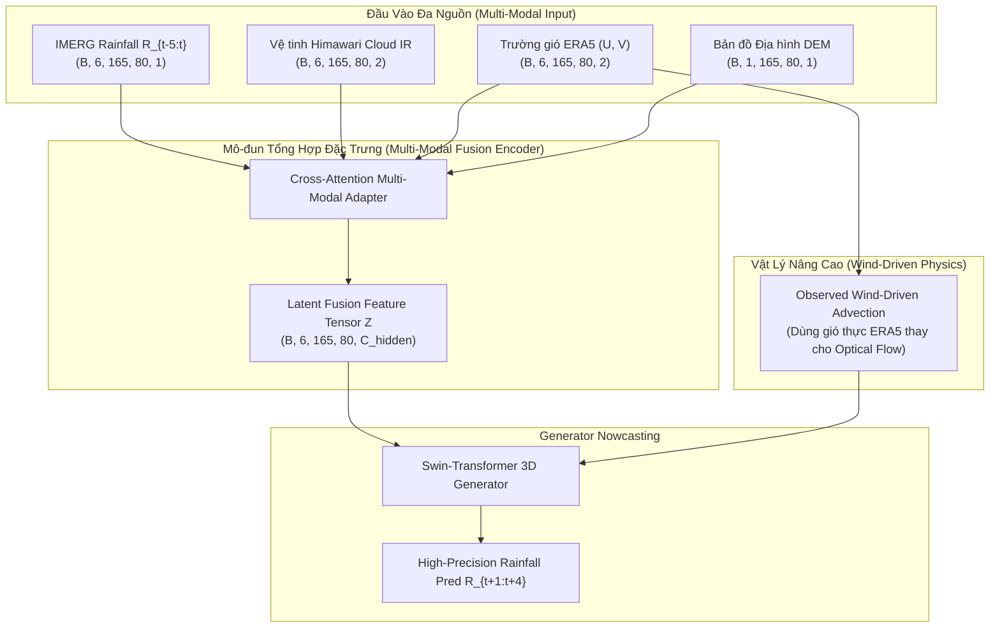

# KIẾN TRÚC TRAIN DỰ BÁO LƯỢNG MƯA VẬT LÝ KẾT HỢP DEEP LEARNING (PIDL ROADMAP)

Tài liệu này mô tả chi tiết kiến trúc huấn luyện bài toán **Dự báo lượng mưa định lượng (Quantitative Precipitation Nowcasting - QPN)** tại Việt Nam, kết hợp giữa **Lý thuyết Vật lý Khí quyển (Partial Differential Equations - PDEs)** và **Deep Learning (Spatiotemporal Modeling)** dựa trên bài báo **ThoR** (*Nature Scientific Reports 2025*) và kết quả thực nghiệm **EDA bộ dữ liệu IMERG (2023–2024)**.

---

## 1. TỔNG QUAN ĐỊNH HƯỚNG PHÁT TRIỂN (ROADMAP OVERVIEW)

Quá trình xây dựng mô hình được chia làm 2 giai đoạn chiến lược:



---

## 2. GIAI ĐOẠN 1: MÔ HÌNH VẬT LÝ KẾT HỢP DEEP LEARNING ĐƠN BIẾN (IMERG ONLY)

### 2.1 Cấu trúc Dữ liệu Input / Output
* **Đầu vào (Input)**: $R_{t-5:t} \in \mathbb{R}^{B \times 6 \times 165 \times 80 \times 1}$ (6 frame lịch sử 30 phút = 3 giờ quá khứ).
* **Đầu ra dự báo (Target)**: $R_{t+1:t+4} \in \mathbb{R}^{B \times 4 \times 165 \times 80 \times 1}$ (4 frame tương lai 30 phút = 2 giờ tới).
* **Đơn vị dữ liệu**: $\text{mm/30 min}$ (đã biến đổi log: $y = \log(1 + x)$).

#### 2.1.1 Bản Chất Feature & Cấu Trúc 1 Dòng Dữ Liệu
* **Feature duy nhất**: `rainfall` ($\text{mm/30 min}$) — Cường độ mưa tích lũy trong 30 phút tại từng điểm lưới.
* **Định dạng NetCDF 3D**: $(\text{time}: 35089, \text{lat}: 165, \text{lon}: 80)$.
* **Cấu trúc 1 Dòng (Pixel-level Record)**: `[time, lat, lon, rainfall]`
  * Mỗi mốc `time` chứa ma trận $165 \times 80 = 13,200$ pixels.
  * Toàn bộ bộ dữ liệu tương đương $35,089 \times 13,200 = \mathbf{463,174,800}$ bản ghi.
* **Cấu trúc 1 Sample Train (Mô hình Deep Learning)**:
  * **Input Tensor $\mathbf{X}$**: Chuỗi 6 ma trận $165 \times 80$ quá khứ $\implies (6, 165, 80, 1)$.
  * **Target Tensor $\mathbf{Y}$**: Chuỗi 4 ma trận $165 \times 80$ tương lai $\implies (4, 165, 80, 1)$.

---

### 2.2 Sơ đồ Kiến trúc Trực quan Giai đoạn 1

```mermaid
graph TD
    subgraph INPUT_STAGE ["Input Data Stream"]
        R_in["Sequence IMERG 6 frames R_{t-5:t}<br/>Shape: (B, 6, 165, 80, 1)"]
    end

    subgraph PHYSICS_MODULE ["1. Nhánh Vật Lý (Physics Engine)"]
        UNet["Motion Estimation U-Net (M_phi)"]
        Burgers["Discretized 2D Burgers' Eq Module<br/>V_{t+dt} = V_t + dt[-(V_t.grad)V_t + mu*Laplacian(V_t)]"]
        R_in -->|R_t, R_{t-1}| UNet
        UNet -->|Velocity Field V_t = (u_t, v_t)| Burgers
        Burgers -->|Velocity Evolution| V_future["Future Flow Fields V_{t+1:t+4}"]
    end

    subgraph GENERATOR_MODULE ["2. Nhánh Sinh Lượng Mưa Deep Learning (Generator G_theta)"]
        Warping["Motion-Conditioned Bilinear Warping Block"]
        ConvGRU["Motion-Guided ConvGRU Cells"]
        AxialAttn["Axial Self-Attention Aggregator (Height & Width)"]
        
        R_in --> Warping
        V_future --> Warping
        Warping --> ConvGRU
        ConvGRU --> AxialAttn
        AxialAttn --> Pred_R["Predicted Rainfall R_{t+1:t+4}<br/>Shape: (B, 4, 165, 80, 1)"]
    end

    subgraph LOSS_STAGE ["3. Hệ Thống Hàm Mất Mát Hỗn Hợp (Hybrid Composite Loss)"]
        L_NN["L_NN: Vietnam Land-Weighted L1 + Multi-Threshold Focal Loss"]
        L_Phys["L_Physics: Dynamic Advection-Diffusion PDE Residual"]
        L_Vel["L_Velocity: Horn-Schunck Rain-Weighted Smoothness"]
        L_Adv["L_Adv: Vietnam Mask PatchGAN Discriminator"]
        
        Pred_R --> L_NN
        Pred_R --> L_Phys
        Pred_R --> L_Adv
        V_future --> L_Vel
    end

    Loss_Total["TOTAL LOSS = alpha*L_Vel + beta*L_Phys + gamma*L_NN + delta*L_Adv"]
    L_NN --> Loss_Total
    L_Phys --> Loss_Total
    L_Vel --> Loss_Total
    L_Adv --> Loss_Total
```

---

### 2.3 Các Phương trình Vật lý Toán học Trong Mô hình
Toàn bộ các toán tử vi phân được tính toán bằng các bộ lọc chênh lệch hữu hạn (Finite Difference Convolutional Operators):

1. **Ràng buộc Mượt Trường Vận Tốc (Horn-Schunck Velocity Loss)**:
   $$\mathcal{L}_{\text{velocity}} = \|\nabla u_t \odot \sqrt{w(R_t)}\|_2^2 + \|\nabla v_t \odot \sqrt{w(R_t)}\|_2^2$$
   với $w(R_t) = \min(24, 1 + R_t)$ giúp ép độ mượt vận tốc tại các vùng có mưa lớn.

2. **Phương trình Tiến hóa Vận tốc Phi tuyến (2D Burgers' Equation)**:
   $$V_{t+\Delta t} = V_t + \Delta t \left[ -(V_t \cdot \nabla) V_t + \mu \nabla^2 V_t \right]$$

3. **Phương trình Bảo toàn Vận chuyển Mưa (Advection-Diffusion PDE Residual)**:
   $$J_{\text{physics}}(\hat{R}, \hat{V}) = \left\| \frac{\hat{R}_t - \hat{R}_{t-1}}{\Delta t} + u_t \frac{\partial \hat{R}}{\partial x} + v_t \frac{\partial \hat{R}}{\partial y} - \nu \left( \frac{\partial^2 \hat{R}}{\partial x^2} + \frac{\partial^2 \hat{R}}{\partial y^2} \right) - S_{\text{residual}} \right\|_2^2$$
   * Trọng số vật lý động thích ứng: $p = e^{\min(\max(J_{\text{physics}}, 0), 1)} \implies \mathcal{L}_{\text{physics}} = \frac{1}{p} J_{\text{physics}}$.

---

### 2.4 Hàm Mất Mát Dữ liệu Tối ưu Cho EDA IMERG Việt Nam
Dựa trên kết quả EDA ($89\%$ không mưa, $21.23\%$ pixel đất liền), hàm $\mathcal{L}_{\text{NN}}$ được cấu thành từ 2 bộ lọc đặc biệt:

1. **Vietnam Land-Weighted L1 Loss**:
   $$\mathcal{L}_{L1} = \frac{1}{N} \sum W_{\text{land}}(x,y) \cdot w(R) \cdot |\hat{R} - R|$$
   * $W_{\text{land}}(x,y) = 2.5$ tại $2,802$ pixels đất liền Việt Nam, $1.0$ tại các vùng biển xung quanh.
2. **Multi-Threshold Focal Intensity Loss ($\mathcal{L}_{\text{MTF}}$)**:
   Phân loại thành 4 nhóm lượng mưa chuẩn EDA để khắc phục tình trạng mất cân bằng cực đoan:
   $$\mathcal{L}_{\text{MTF}} = -\sum_{c=0}^{3} \alpha_c (1 - p_c)^\gamma \log(p_c)$$
   với $\alpha = [1.0, 3.0, 10.0, 30.0]$ tương ứng 4 bin: $[0, 0.1)$, $[0.1, 2.5)$, $[2.5, 10)$, $[\ge 10\text{ mm/30 min}]$.

---

## 3. GIAI ĐOẠN 2: KẾT HỢP ĐA DỮ LIỆU (MULTI-MODAL DATA FUSION)

Sau khi hoàn thành Giai đoạn 1, mô hình sẽ được mở rộng để tiếp nhận dữ liệu đa nguồn:

### 3.1 Các Nguồn Dữ liệu Mở rộng
1. **Địa hình DEM (Topography)**: Ảnh ma trận độ cao cố định 2D $(165 \times 80)$. Giúp mô hình học hiệu ứng bẫy địa hình (orographic rain) tại dãy Trường Sơn và vùng núi phía Bắc.
2. **Ảnh vệ tinh mây Himawari-8/9**: Chuỗi ảnh hồng ngoại (IR) và quang học (VIS). Giúp phát hiện sớm các đám mây đối lưu phát triển trước khi tạo thành mưa.
3. **Trường gió độ cao ERA5**: Vector gió $(U_{10m}, V_{10m}, U_{850hPa}, V_{850hPa})$. Cung cấp trường vận tốc thực tế thay vì chỉ dùng trường vận tốc ước tính từ dòng chảy quang học.

---

### 3.2 Sơ đồ Kiến trúc Mở rộng Giai đoạn 2



---

## 4. YÊU CẦU VỀ PHẦN CỨNG & QUÁ TRÌNH HUẤN LUYỆN (TRAINING SETUP)

### 4.1 Phần cứng & Môi trường Khuyến nghị
* **GPU**: NVIDA Tesla T4 / P100 (Kaggle/Colab) hoặc V100 / A100 ($VRAM \ge 16\text{GB}$).
* **RAM Hệ thống**: $\ge 16\text{GB}$.
* **Thư viện chính**: `torch >= 2.0`, `xarray`, `netCDF4`, `numpy`, `scipy`, `matplotlib`, `geopandas`.

---

### 4.2 Chiến lược Phân chia Tập Dữ liệu (Data Split Strategy)

```text
+-----------------------------------------------------------------------------------+
|                        TẬP DỮ LIỆU HUẤN LUYỆN & KIỂM THỬ                          |
+----------------------------------------------------+------------------------------+
|                     2023 - 2024                    |         2025 - 2026          |
|                  (Đã có sẵn EDA)                   |          (Tải sau)            |
+--------------------------+-------------------------+------------------------------+
|   Train Internal (75%)   |   Val Internal (25%)    | Out-of-Distribution Test     |
| 2023-01-01 -> 2024-06-30 | 2024-07-01 -> 2024-12-31 | (Strict Multi-Year Test)     |
|   (~26,200 timesteps)    | (~8,800 timesteps - Yagi)| 2025-01-01 -> 2026-12-31     |
+--------------------------+-------------------------+------------------------------+
```

1. **Phát triển & Tuning Mô hình (Phase 1 Development)**:
   * **Train Internal**: 1.5 năm dữ liệu từ `2023-01-01` đến `2024-06-30`.
   * **Val Internal**: 6 tháng cuối năm `2024` (chứa siêu bão Yagi tháng 9/2024 để đánh giá khả năng bắt bão).
2. **Huấn luyện Lại Toàn Bộ (Full Retrain Stage)**:
   * Chốt hyperparameter tốt nhất $\rightarrow$ Train lại 100% trên toàn bộ 2 năm 2023–2024 (35,089 frames).
3. **Đánh giá Ngoại miền (Out-of-Distribution Testing Stage)**:
   * Dùng tập dữ liệu 2025–2026 để test đánh giá khả năng tổng quát hóa thực tế qua các năm mới.

---

### 4.3 Bảng Siêu Tham Số Huấn Luyện (Hyperparameters)

| Tham số | Giá trị | Giải thích |
| :--- | :--- | :--- |
| **Input Steps** | $6$ | 6 frame $\times$ 30 min = 3 giờ quá khứ |
| **Prediction Steps** | $4$ | 4 frame $\times$ 30 min = 2 giờ tương lai |
| **Batch Size** | $8$ đến $16$ | Đảm bảo vừa bộ nhớ GPU VRAM |
| **Optimizer** | `AdamW` | $\beta_1=0.5, \beta_2=0.999$, weight_decay=$10^{-4}$ |
| **Learning Rate** | $1 \times 10^{-3}$ | Giảm 50% nếu Val Loss dừng giảm 4 epochs |
| **Loss Weight $\alpha$ (Vel)** | $0.1$ | Trọng số mượt vận tốc |
| **Loss Weight $\beta$ (Phys)**| $0.2 \rightarrow 0.5$ | Warmup trọng số vật lý sau epoch 10 |
| **Loss Weight $\gamma$ (NN)**  | $1.0$ | Trọng số mất mát dữ liệu chính |
| **Loss Weight $\delta$ (Adv)** | $0.05$ | Trọng số PatchGAN discriminator |

---

## 5. ĐÁNH GIÁ ƯU ĐIỂM VÀ NHƯỢC ĐIỂM (PROS & CONS)

### 5.1 So sánh Giai đoạn 1 vs Giai đoạn 2

| Tiêu chí | Giai đoạn 1 (Chỉ dùng IMERG) | Giai đoạn 2 (Đa dữ liệu Himawari, ERA5, DEM) |
| :--- | :--- | :--- |
| **Độ phức tạp Data** | **Thấp / Dễ làm**: Chỉ cần file NetCDF IMERG duy nhất. | **Cao**: Phải căn chỉnh không gian/thời gian (regrid) nhiều nguồn. |
| **Tốc độ Huấn luyện** | **Nhanh**: Tensor nhẹ $(B, 6, 165, 80, 1)$, hội tụ nhanh. | **Chậm hơn**: Dung lượng tensor lớn, tốn VRAM GPU. |
| **Dự báo Di chuyển Mây** | **Rất Tốt**: Nhờ toán tử Advection & Burgers' Eq. | **Cực Kỳ Tốt**: Có thêm trường gió thực tế ERA5 hỗ trợ. |
| **Dự báo Mây Phát triển Tại chỗ** | **Khá**: Dựa vào phần dư $S_{\text{residual}}$ tự học từ $R$. | **Rất Xuất Sắc**: Ảnh hồng ngoại Himawari bắt được mây đối lưu bùng phát trước 1-2 tiếng. |

---

### 5.2 Bảng So sánh Mô hình Đề xuất với các Baseline Hiện Tại

| Mô hình | Tích hợp Vật lý | Khắc phục Mờ nét (Over-smoothing) | Tập trung Đất liền Việt Nam | Xử lý Mất cân bằng Mưa |
| :--- | :---: | :---: | :---: | :---: |
| **ConvLSTM / TrajGRU** | ❌ Không | ❌ Kém | ❌ Không | ❌ Kém (Chỉ dùng MSE) |
| **PredRNN v2** | ❌ Không | ⚠️ Trung bình | ❌ Không | ⚠️ Trung bình |
| **DiffCast / PreDiff** | ❌ Không |  Tốt | ❌ Không | ⚠️ Trung bình |
| **ThoR (Gốc - 2025)** |  Có (Advection 2D) |  Tốt | ❌ Không (Chỉ crop Bbox) |  Tốt (Dùng ICL 3 bins) |
| **PIDL Đề xuất (Giai đoạn 1)** |  **Có (Advection + Burgers)** |  **Xuất sắc (MTF Loss + GAN)** |  **Có (Land Mask Weight 2.5x)** |  **Xuất sắc (MTF 4 bins EDA)** |

---

## 6. KẾT LUẬN

Tài liệu này định hình **khung kiến trúc huấn luyện chuẩn hóa** cho dự án Nowcasting lượng mưa tại Việt Nam. Việc tập trung tối ưu **Giai đoạn 1** trên dữ liệu IMERG sẵn có sẽ giúp nhanh chóng hoàn thành baseline vững chắc, có tính giải thích vật lý cao và đạt kết quả vượt trội so với các mô hình thuần Deep Learning.
