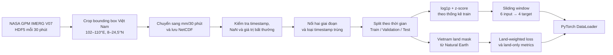
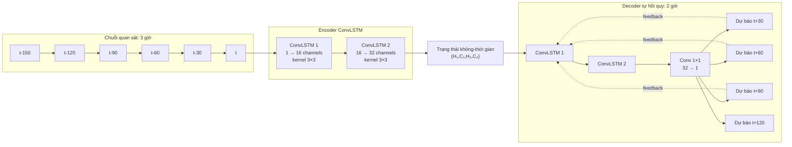
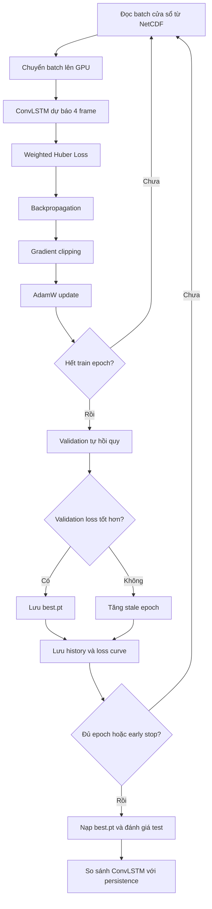

# BÁO CÁO GIAI ĐOẠN 1: DỰ BÁO MƯA NGẮN HẠN TẠI VIỆT NAM

## Tóm tắt

Trong giai đoạn 1, đề tài xây dựng một pipeline hoàn chỉnh cho bài toán dự báo mưa ngắn hạn trên lãnh thổ Việt Nam, từ thu thập dữ liệu vệ tinh, kiểm tra và tiền xử lý dữ liệu, tạo tập huấn luyện, xây dựng mô hình ConvLSTM, huấn luyện, đánh giá đến trực quan hóa kết quả.

Bài toán hiện tại sử dụng **6 ảnh mưa liên tiếp trong 3 giờ gần nhất** để dự báo **4 ảnh mưa trong 2 giờ tiếp theo**. Mỗi ảnh cách nhau 30 phút và có kích thước không gian `165 × 80`. ConvLSTM được chọn làm mô hình baseline nhằm kiểm chứng toàn bộ pipeline trước khi phát triển các mô hình phức tạp hơn như mô hình kết hợp dữ liệu ERA5, Himawari hoặc các ràng buộc vật lý.

Kết quả trên tập test cho thấy ConvLSTM đạt MAE `0,170 mm/30 phút` và RMSE `0,598 mm/30 phút`, giảm lần lượt khoảng `22,1%` và `22,2%` so với persistence baseline. Mô hình dự báo khá tốt mưa nhẹ và mưa vừa trong khoảng 30–120 phút, nhưng vẫn còn hạn chế đối với mưa lớn và dự báo cuốn chiếu dài hạn.

---

## 1. Tìm và thu thập dữ liệu

### 1.1. Nguồn dữ liệu

Dữ liệu chính được sử dụng là **NASA GPM IMERG Final Run**, với các thông tin:

| Thuộc tính | Giá trị |
|---|---|
| Collection | `GPM_3IMERGHH` |
| Version | `07` |
| Tần suất | 30 phút/frame |
| Biến sử dụng | `precipitationCal` hoặc `precipitation` |
| Đơn vị sau xử lý | `mm/30 phút` |
| Bounding box | `102–110°E`, `8–24,5°N` |
| Độ phân giải | Xấp xỉ `0,1°` |
| Kích thước mỗi frame | `165 × 80 = 13.200 pixel` |

Các notebook tải dữ liệu:

- [`dowload_imerg_2023_2024.ipynb`](../IMERG/dowload_imerg_2023_2024.ipynb): tải dữ liệu từ đầu năm 2023 đến hết năm 2024.
- [`dowload_imerg_2025_2026.ipynb`](../IMERG/dowload_imerg_2025_2026.ipynb): tải tiếp dữ liệu từ đầu năm 2025 và hỗ trợ resume.

### 1.2. Phương pháp tải

Thư viện `earthaccess` được sử dụng để đăng nhập NASA Earthdata, tìm kiếm các granule đúng collection, version, thời gian và vùng địa lý. Dữ liệu được tải theo batch 100 granule để giảm rủi ro lỗi mạng và giới hạn bộ nhớ.

Pipeline tải dữ liệu có các cơ chế:

1. Kiểm tra timestamp đã tồn tại trước khi tải.
2. Tự động tiếp tục từ phần còn thiếu khi notebook bị gián đoạn.
3. Thử tải lại tối đa ba lần nếu một batch thất bại.
4. Thử lại từng granule nếu batch vẫn còn thiếu file.
5. Ghi danh sách granule lỗi để có thể kiểm tra lại.
6. Xóa file HDF5 tạm sau khi đã crop và ghi thành công vào NetCDF.

### 1.3. Khối lượng dữ liệu thu được

| File dữ liệu | Khoảng thời gian | Số frame | Ghi chú |
|---|---|---:|---|
| `imerg_vietnam_2023_2024.nc` | 01/01/2023 – 01/01/2025 | 35.089 | Có frame biên ngày 01/01/2025 |
| `imerg_vietnam_2025_2026.nc` | 01/01/2025 – 30/09/2025 | 13.104 | Chưa có dữ liệu sau 30/09/2025 trong lần tải hiện tại |
| Dữ liệu sau khi nối | 01/01/2023 – 30/09/2025 | 48.192 | Đã loại frame trùng tại ranh giới hai file |

Pipeline không tự gán lượng mưa bằng 0 cho khoảng thời gian chưa tải, vì giá trị 0 mang ý nghĩa “không mưa”, khác hoàn toàn với “không có dữ liệu”.

---

## 2. Xử lý dữ liệu

### 2.1. Crop và chuyển đổi dữ liệu

Với mỗi granule HDF5, pipeline thực hiện:

1. Đọc biến mưa, latitude và longitude.
2. Chuẩn hóa thứ tự hai trục không gian.
3. Sắp xếp tọa độ theo thứ tự tăng dần.
4. Crop theo bounding box bao quanh Việt Nam.
5. Nhân giá trị cường độ mưa với `0,5` để chuyển thành lượng mưa tích lũy trong 30 phút.
6. Chuyển giá trị âm hoặc không hữu hạn thành `NaN`.
7. Ghi từng frame vào file NetCDF có nén.

Sau khi crop, tâm các pixel nằm trong phạm vi:

- Vĩ độ: `8,05°` đến `24,45°`.
- Kinh độ: `102,05°` đến `109,95°`.

### 2.2. Kiểm tra và phân tích dữ liệu

Hai notebook EDA được sử dụng để kiểm tra tính toàn vẹn và đặc điểm thống kê:

- [`eda_imerg_2023_2024.ipynb`](../IMERG/eda_imerg_2023_2024.ipynb)
- [`eda_imerg_2025_2026.ipynb`](../IMERG/eda_imerg_2025_2026.ipynb)

Các nội dung kiểm tra gồm:

- Timestamp thiếu, trùng hoặc không cách nhau đúng 30 phút.
- Tỷ lệ `NaN`, giá trị âm và giá trị bất thường.
- Phân bố lượng mưa và tỷ lệ các cấp mưa.
- Bản đồ lượng mưa trung bình và cực đại.
- Sự thay đổi lượng mưa theo ngày, tháng và mùa.
- Độ tương quan không gian giữa các frame liên tiếp.
- Tính liên tục của một cửa sổ gồm 6 frame đầu vào và 4 frame mục tiêu.

Kết quả EDA cho thấy dữ liệu trong khoảng thời gian đã quan sát không có timestamp bị thiếu ở giữa chuỗi, không có timestamp trùng và không có `NaN`.

Dữ liệu có mức mất cân bằng cao:

| Mức mưa | 2023–2024 | 2025 đến tháng 9 |
|---|---:|---:|
| Không mưa, `< 0,1 mm/30 phút` | 88,998% | 87,724% |
| Mưa nhẹ, `0,1–2,5 mm/30 phút` | 10,037% | 11,151% |
| Mưa vừa, `2,5–10 mm/30 phút` | 0,921% | 1,070% |
| Mưa lớn, `10–50 mm/30 phút` | 0,044% | 0,055% |

Phân bố này cho thấy nếu sử dụng loss thông thường, mô hình có thể đạt loss thấp bằng cách ưu tiên dự báo gần 0. Do đó, pipeline sử dụng biến đổi log và loss có trọng số cho pixel mưa.

### 2.3. Chia tập dữ liệu

Dữ liệu được chia theo thời gian, không xáo trộn ngẫu nhiên:

| Tập | Khoảng thời gian | Số frame | Số cửa sổ hợp lệ |
|---|---|---:|---:|
| Train | 01/01/2023 – 31/12/2024 | 35.088 | 35.079 |
| Validation | 01/01/2025 – 30/06/2025 | 8.688 | 8.679 |
| Test | 01/07/2025 – 30/09/2025 | 4.416 | 4.407 |

Việc chia theo thời gian mô phỏng đúng tình huống thực tế: mô hình học từ quá khứ và được đánh giá trên một giai đoạn tương lai chưa xuất hiện trong tập train.

### 2.4. Tạo sliding window

Mỗi mẫu dữ liệu gồm 10 frame liên tiếp:

```text
Input:  t-150, t-120, t-90, t-60, t-30, t
Target: t+30,  t+60,  t+90, t+120
```

Chỉ số bắt đầu của cửa sổ chỉ được lưu nếu:

- Đủ 10 frame.
- Hai frame liên tiếp cách nhau đúng 30 phút.
- Tất cả pixel đều hữu hạn.
- Cửa sổ nằm hoàn toàn trong một split.

Dataset đọc các cửa sổ trực tiếp từ NetCDF khi cần, thay vì nạp toàn bộ split vào RAM. Tensor cung cấp cho mô hình có dạng:

- Input: `(B, 6, 1, 165, 80)`.
- Target: `(B, 4, 1, 165, 80)`.

### 2.5. Chuẩn hóa

Lượng mưa có phân bố lệch phải mạnh, do phần lớn pixel bằng 0 nhưng vẫn tồn tại một số giá trị mưa lớn. Pipeline chuẩn hóa theo hai bước:

$$
x_{log} = \log(1+x)
$$

$$
z = \frac{x_{log}-\mu_{train}}{\sigma_{train}}
$$

Trong đó:

- $\mu_{train}=0,06256736$.
- $\sigma_{train}=0,22905120$.

Hai thống kê này chỉ được tính từ tập train. Khi đánh giá, giá trị chuẩn hóa được đưa về đơn vị vật lý bằng:

$$
x = \exp(z\sigma_{train}+\mu_{train})-1
$$

### 2.6. Vietnam land mask

Bounding box chứa cả biển và khu vực ngoài lãnh thổ Việt Nam. Pipeline sử dụng polygon Việt Nam từ Natural Earth và kiểm tra tâm của từng pixel để tạo:

- `land_mask = 1` nếu tâm pixel nằm trong lãnh thổ Việt Nam, ngược lại bằng 0.
- `W_land = 2,5` trên đất liền Việt Nam và `1,0` ở bên ngoài.

Có `2.802/13.200` pixel nằm trong polygon Việt Nam, tương đương `21,23%` grid.

### 2.7. Luồng xử lý dữ liệu



---

## 3. Mô hình ConvLSTM

### 3.1. Lý do lựa chọn

Ảnh mưa IMERG vừa có quan hệ không gian giữa các pixel lân cận, vừa có quan hệ thời gian giữa các frame liên tiếp. LSTM thông thường có thể học quan hệ thời gian nhưng sẽ làm phẳng ảnh thành vector và làm mất cấu trúc không gian. CNN có thể học đặc trưng không gian nhưng không tự duy trì trạng thái qua thời gian.

ConvLSTM thay các phép biến đổi tuyến tính trong LSTM bằng convolution. Nhờ đó, hidden state và cell state vẫn giữ nguyên cấu trúc hai chiều của bản đồ mưa. Đây là một baseline phù hợp để kiểm tra khả năng học chuyển động, hình dạng và sự thay đổi cường độ của vùng mưa.

### 3.2. ConvLSTM cell

Tại thời điểm $t$, ConvLSTM nhận frame đầu vào $X_t$, hidden state $H_{t-1}$ và cell state $C_{t-1}$. Các cổng được tính bằng convolution trên phép nối theo chiều channel của $X_t$ và $H_{t-1}$:

$$
\begin{aligned}
i_t &= \sigma(W_i * [X_t,H_{t-1}] + b_i) \\
f_t &= \sigma(W_f * [X_t,H_{t-1}] + b_f) \\
o_t &= \sigma(W_o * [X_t,H_{t-1}] + b_o) \\
\widetilde{C}_t &= \tanh(W_c * [X_t,H_{t-1}] + b_c)
\end{aligned}
$$

Cell state và hidden state mới:

$$
C_t=f_t\odot C_{t-1}+i_t\odot \widetilde{C}_t
$$

$$
H_t=o_t\odot\tanh(C_t)
$$

Trong đó `*` là phép convolution, $\odot$ là phép nhân theo từng phần tử và $\sigma$ là hàm sigmoid.

### 3.3. Cấu hình mô hình

Mô hình được cài đặt trong [`rainfall_nowcasting/model.py`](../rainfall_nowcasting/model.py) với cấu hình:

| Thành phần | Cấu hình | Output/state |
|---|---|---|
| Input | 6 frame, 1 channel | `(B, 6, 1, 165, 80)` |
| ConvLSTM layer 1 | Hidden channel `16`, kernel `3 × 3` | `(B, 16, 165, 80)` |
| ConvLSTM layer 2 | Hidden channel `32`, kernel `3 × 3` | `(B, 32, 165, 80)` |
| Output projection | Conv2D `1 × 1`, `32 → 1` | `(B, 1, 165, 80)` |
| Forecast | 4 bước tự hồi quy | `(B, 4, 1, 165, 80)` |

Mô hình có khoảng **65.313 tham số học được**. Padding được lựa chọn để mọi feature map giữ nguyên kích thước `165 × 80`.

### 3.4. Kiến trúc encoder–decoder tự hồi quy



Trong phần encoder, hai ConvLSTM layer lần lượt đọc 6 frame quan sát và cập nhật trạng thái. Sau frame cuối cùng, các trạng thái này chứa biểu diễn không-thời gian của chuỗi mưa.

Trong phần decoder, frame quan sát cuối cùng được dùng để tạo dự báo đầu tiên. Kết quả dự báo sau đó được đưa trở lại mô hình để dự báo bước tiếp theo. Cơ chế này được lặp bốn lần để tạo bốn bản đồ mưa tương lai.

### 3.5. Luồng tensor qua mô hình

```text
Input                       (B, 6, 1, 165, 80)
  │
  ├─ Đọc tuần tự 6 frame
  ▼
ConvLSTM layer 1 state      (B, 16, 165, 80)
  ▼
ConvLSTM layer 2 state      (B, 32, 165, 80)
  │
  ├─ Decoder step 1 → Conv 1×1 → dự báo +30 phút
  ├─ Decoder step 2 → Conv 1×1 → dự báo +60 phút
  ├─ Decoder step 3 → Conv 1×1 → dự báo +90 phút
  └─ Decoder step 4 → Conv 1×1 → dự báo +120 phút
  ▼
Output                      (B, 4, 1, 165, 80)
```

### 3.6. Persistence baseline

Mô hình được so sánh với persistence baseline. Baseline này lặp lại frame quan sát cuối cùng cho cả bốn bước dự báo:

$$
\hat{X}_{t+k}=X_t,\quad k\in\{30,60,90,120\}\text{ phút}
$$

Đây là baseline quan trọng cho nowcasting vì các vùng mưa thường có tính liên tục cao trong thời gian ngắn. Mô hình học máy chỉ thực sự có ý nghĩa khi cải thiện được kết quả so với phương pháp đơn giản này.

---

## 4. Phương pháp huấn luyện

### 4.1. Hàm mất mát

Mô hình sử dụng **Weighted Huber Loss**. Với dự báo $\hat{y}$ và ground truth $y$, Huber loss kết hợp ưu điểm của MAE và MSE: nhạy với sai số nhỏ nhưng ít bị chi phối bởi outlier hơn MSE.

Trọng số của mỗi pixel gồm hai thành phần:

$$
w = W_{land}\left(1+2\cdot\mathbb{1}[y\geq0,1]\right)
$$

Trong đó:

- $W_{land}=2,5$ trên đất liền Việt Nam và bằng `1,0` ở ngoài.
- Pixel có mưa từ `0,1 mm/30 phút` được tăng trọng số.
- Ngưỡng mưa được chuyển sang miền chuẩn hóa trước khi tính loss.

Loss cuối cùng:

$$
\mathcal{L}=\frac{\sum w\cdot\operatorname{SmoothL1}(\hat{y},y)}{\sum w}
$$

Cách thiết kế này giúp mô hình không chỉ tối ưu trên các pixel không mưa chiếm đa số, đồng thời ưu tiên chất lượng dự báo trong lãnh thổ Việt Nam.

### 4.2. Cấu hình train

| Tham số | Giá trị |
|---|---:|
| Epoch | 30 |
| Batch size | 4 |
| Optimizer | AdamW |
| Learning rate | `1 × 10⁻³` |
| Weight decay | `1 × 10⁻⁴` |
| Huber beta | `0,5` |
| Rain threshold | `0,1 mm/30 phút` |
| Rain boost | `2,0` |
| Teacher forcing | Giảm tuyến tính từ `0,5` xuống `0` |
| Gradient clipping | `1,0` |
| Early stopping patience | 6 epoch |
| Random seed | 42 |
| Thiết bị train | CUDA GPU |

### 4.3. Teacher forcing và autoregressive training

Trong các epoch đầu, teacher forcing cho phép decoder đôi lúc sử dụng frame thật của bước trước làm đầu vào. Tỷ lệ này được giảm tuyến tính từ `0,5` xuống `0`. Đến cuối quá trình train, mô hình phải sử dụng hoàn toàn kết quả của chính nó, giống với điều kiện inference thực tế.

Do bài toán train ngày càng khó hơn khi teacher forcing giảm, train loss có thể tăng dù validation loss vẫn giảm. Vì vậy, không nên kết luận overfitting chỉ dựa trên khoảng cách giữa hai đường loss; validation được đánh giá hoàn toàn tự hồi quy mới là tiêu chí chọn checkpoint.

### 4.4. Quy trình train và đánh giá



Mixed precision được bật khi sử dụng CUDA để giảm bộ nhớ và tăng tốc. Gradient được giới hạn norm ở mức `1,0`. Mỗi epoch đều lưu checkpoint cuối, lịch sử loss và đồ thị; checkpoint có validation loss thấp nhất được lưu riêng tại `best.pt`.

### 4.5. Chỉ số đánh giá

Các dự báo được inverse transform về `mm/30 phút` trước khi đánh giá. Metric chỉ được tính tại các pixel thuộc land mask Việt Nam:

- **MAE:** sai số tuyệt đối trung bình.
- **RMSE:** nhạy hơn với các sai số lớn.
- **CSI:** khả năng dự báo đúng một sự kiện mưa tại các ngưỡng `0,1`, `2,5` và `10 mm/30 phút`.
- **FSS:** đánh giá độ tương đồng theo vùng lân cận tại cửa sổ `3 × 3` và `5 × 5`, phù hợp khi vùng mưa dự báo bị lệch vị trí một vài pixel.

---

## 5. Kết quả giai đoạn 1

### 5.1. Quá trình hội tụ

Sau 30 epoch, validation loss tốt nhất là `0,187581`, đạt tại epoch 30. Validation loss giảm từ `0,201217` ở epoch đầu xuống `0,187581`.


**Hình 1.** Weighted Huber loss trong 30 epoch. Train loss tăng dần ở giai đoạn sau chủ yếu vì teacher forcing được giảm từ `0,5` về `0`, khiến mô hình phải tự hồi quy nhiều hơn. Trong khi đó, validation loss được đo trong điều kiện tự hồi quy và vẫn có xu hướng giảm.

### 5.2. Kết quả tổng hợp trên test

| Chỉ số | ConvLSTM | Persistence | Nhận xét |
|---|---:|---:|---|
| MAE | **0,170** | 0,218 | ConvLSTM giảm khoảng 22,1% |
| RMSE | **0,598** | 0,770 | ConvLSTM giảm khoảng 22,2% |
| CSI 0,1 mm | **0,549** | 0,494 | Tốt hơn với sự kiện có mưa |
| CSI 2,5 mm | **0,327** | 0,289 | Tốt hơn với mưa vừa |
| CSI 10 mm | 0,083 | **0,133** | Chưa tốt với mưa lớn |
| FSS 0,1 mm, 3×3 | **0,810** | 0,792 | Giữ cấu trúc vùng mưa tốt hơn |
| FSS 2,5 mm, 3×3 | **0,633** | 0,609 | Cải thiện ở mưa vừa |

Kết quả chứng minh ConvLSTM không chỉ lặp lại frame cuối mà đã học được sự biến đổi của trường mưa. Mô hình cải thiện rõ rệt MAE, RMSE và các metric của mưa nhẹ đến mưa vừa.

Tuy nhiên, CSI tại ngưỡng 10 mm thấp hơn persistence. Nguyên nhân chính có thể đến từ mức mất cân bằng rất cao của mưa lớn và xu hướng làm mượt của loss theo pixel. Đây là hạn chế chính cần giải quyết trong giai đoạn tiếp theo.

### 5.3. Kết quả theo lead time

| Lead time | MAE | RMSE | CSI 0,1 mm | CSI 2,5 mm | CSI 10 mm |
|---|---:|---:|---:|---:|---:|
| +30 phút | 0,118 | 0,451 | 0,678 | 0,516 | 0,215 |
| +60 phút | 0,161 | 0,571 | 0,574 | 0,359 | 0,083 |
| +90 phút | 0,191 | 0,647 | 0,507 | 0,253 | 0,021 |
| +120 phút | 0,210 | 0,696 | 0,464 | 0,177 | 0,002 |

Sai số tăng và CSI giảm khi lead time dài hơn. Đây là đặc trưng thường gặp của mô hình tự hồi quy: sai số từ dự báo trước trở thành một phần đầu vào cho lần dự báo sau.

### 5.4. Kết quả trực quan dự báo 2 giờ


**Hình 2.** Ví dụ dự báo tại bốn lead time 30, 60, 90 và 120 phút. Cột trái là ground truth, cột giữa là dự báo ConvLSTM và cột phải là sai số `prediction - ground truth`.

Ở ví dụ này, mô hình giữ được vị trí tổng quát và hình dạng chính của vùng mưa, đặc biệt tại mốc 30–60 phút. Khi thời gian dự báo tăng lên, bản đồ mưa dự báo trở nên mượt hơn, cực đại mưa giảm và sai số tăng dần.

### 5.5. Thử nghiệm dự báo cuốn chiếu 24 giờ

Mô hình được train cho 4 frame, tức horizon 2 giờ. Repo có thêm thử nghiệm dự báo 48 frame của ngày tiếp theo bằng cách chạy mô hình liên tiếp 12 block và đưa dự báo cũ trở lại làm input.


**Hình 3.** Tổng lượng mưa ngày 29/09/2025: ground truth, dự báo cuốn chiếu và sai số.

Trong thử nghiệm này:

- Lượng mưa trung bình ngày quan sát: `49,80 mm`.
- Lượng mưa trung bình ngày dự báo: `16,39 mm`.
- Bias trung bình mỗi frame: `-0,696 mm`.
- MAE của tổng lượng mưa ngày: `35,87 mm`.

Sau nhiều vòng lặp, dự báo dần suy giảm về mưa nhỏ và đánh giá thấp đáng kể lượng mưa thực tế. Kết quả này được xem là phép thử giới hạn của mô hình, không phải dự báo nghiệp vụ, vì mô hình chưa được huấn luyện trực tiếp cho horizon 24 giờ.

### 5.6. Kết luận giai đoạn 1

Các kết quả đã hoàn thành trong giai đoạn 1 gồm:

1. Xây dựng pipeline tải và crop dữ liệu NASA GPM IMERG có resume và retry.
2. Kiểm tra integrity, phân tích phân bố và trực quan hóa dữ liệu mưa.
3. Nối dữ liệu, chia tập theo thời gian và ngăn data leakage.
4. Tạo sliding window 6 frame đầu vào và 4 frame mục tiêu.
5. Tạo Vietnam land mask và trọng số ưu tiên đất liền Việt Nam.
6. Cài đặt ConvLSTM encoder–decoder tự hồi quy.
7. Cài đặt Weighted Huber Loss cho dữ liệu mưa mất cân bằng.
8. Hoàn thiện training loop, mixed precision, checkpoint và early stopping.
9. Đánh giá ConvLSTM với persistence bằng MAE, RMSE, CSI và FSS.
10. Xây dựng công cụ trực quan dự báo 2 giờ và khảo sát dự báo cuốn chiếu 24 giờ.

ConvLSTM đã vượt persistence baseline về sai số tổng thể và khả năng dự báo mưa nhẹ đến vừa. Hạn chế lớn nhất là dự báo mưa cực đoan, suy giảm cường độ theo lead time và tích lũy sai số khi dự báo dài. Đây là cơ sở để giai đoạn tiếp theo tập trung vào loss cho mưa lớn, mô hình đa nguồn dữ liệu và các ràng buộc động lực học vật lý.

---

## Tài liệu và mã nguồn liên quan

- [`IMERG/README.md`](../IMERG/README.md): mô tả dữ liệu và pipeline chuẩn bị dữ liệu.
- [`IMERG/run.ipynb`](../IMERG/run.ipynb): nối, split, tạo mask và chuẩn hóa dữ liệu.
- [`rainfall_nowcasting/model.py`](../rainfall_nowcasting/model.py): kiến trúc ConvLSTM.
- [`rainfall_nowcasting/losses.py`](../rainfall_nowcasting/losses.py): Weighted Huber Loss.
- [`rainfall_nowcasting/train.py`](../rainfall_nowcasting/train.py): quy trình huấn luyện.
- [`rainfall_nowcasting/metrics.py`](../rainfall_nowcasting/metrics.py): MAE, RMSE, CSI và FSS.
- [`MODEL_TRAINING.md`](../MODEL_TRAINING.md): hướng dẫn train và đánh giá.
- [`test_metrics.json`](../IMERG_data/outputs/convlstm/test_metrics.json): kết quả đánh giá đầy đủ trên test.
