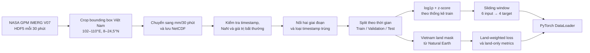
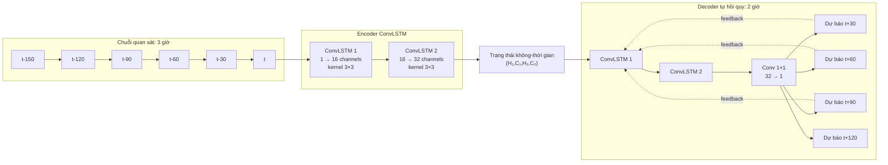
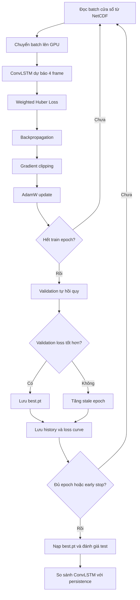
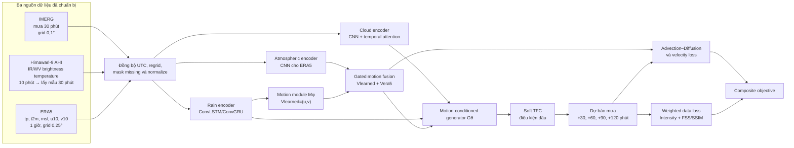

# BÁO CÁO GIAI ĐOẠN 1: DỰ BÁO MƯA NGẮN HẠN TẠI VIỆT NAM

## Tóm tắt

Trong giai đoạn 1, đề tài xây dựng một pipeline hoàn chỉnh cho bài toán dự báo mưa ngắn hạn trên lãnh thổ Việt Nam, từ thu thập dữ liệu vệ tinh, kiểm tra và tiền xử lý dữ liệu, tạo tập huấn luyện, xây dựng mô hình ConvLSTM, huấn luyện, đánh giá đến trực quan hóa kết quả.

Bài toán hiện tại sử dụng **6 ảnh mưa liên tiếp trong 3 giờ gần nhất** để dự báo **4 ảnh mưa trong 2 giờ tiếp theo**. Mỗi ảnh cách nhau 30 phút và có kích thước không gian `165 × 80`. ConvLSTM được chọn làm mô hình baseline nhằm kiểm chứng toàn bộ pipeline trước khi phát triển các mô hình phức tạp hơn như mô hình kết hợp dữ liệu ERA5, Himawari hoặc các ràng buộc vật lý.

Kết quả trên tập test cho thấy ConvLSTM đạt MAE `0,170 mm/30 phút` và RMSE `0,598 mm/30 phút`, giảm lần lượt khoảng `22,1%` và `22,2%` so với persistence baseline. Mô hình dự báo khá tốt mưa nhẹ và mưa vừa trong khoảng 30–120 phút, nhưng vẫn còn hạn chế đối với mưa lớn và dự báo cuốn chiếu dài hạn.

Bên cạnh IMERG, đề tài đã khảo sát và xây dựng pipeline ban đầu cho hai nguồn dữ liệu bổ sung là **Himawari-9** và **ERA5**. Himawari cung cấp thông tin mây qua các băng hồng ngoại/hơi nước; ERA5 cung cấp trường gió, nhiệt độ và áp suất. Hai nguồn này chưa được đưa vào checkpoint ConvLSTM hiện tại, nhưng là nền tảng cho mô hình đa nguồn và physics-informed ở giai đoạn tiếp theo.

---

## 1. Tìm và thu thập dữ liệu

### 1.1. Nguồn dữ liệu

Dữ liệu chính được sử dụng là **NASA GPM IMERG Final Run**, với các thông tin:

| Thuộc tính | Giá trị |
|---|---|
| Collection | `GPM_3IMERGHH` |
| Version | `07` |
| Tần suất | 30 phút/frame |
| Biến sử dụng | `precipitationCal` hoặc `precipitation` |
| Đơn vị sau xử lý | `mm/30 phút` |
| Bounding box | `102–110°E`, `8–24,5°N` |
| Độ phân giải | Xấp xỉ `0,1°` |
| Kích thước mỗi frame | `165 × 80 = 13.200 pixel` |

Các notebook tải dữ liệu:

- [`dowload_imerg_2023_2024.ipynb`](../IMERG/dowload_imerg_2023_2024.ipynb): tải dữ liệu từ đầu năm 2023 đến hết năm 2024.
- [`dowload_imerg_2025_2026.ipynb`](../IMERG/dowload_imerg_2025_2026.ipynb): tải tiếp dữ liệu từ đầu năm 2025 và hỗ trợ resume.

### 1.2. Phương pháp tải

Thư viện `earthaccess` được sử dụng để đăng nhập NASA Earthdata, tìm kiếm các granule đúng collection, version, thời gian và vùng địa lý. Dữ liệu được tải theo batch 100 granule để giảm rủi ro lỗi mạng và giới hạn bộ nhớ.

Pipeline tải dữ liệu có các cơ chế:

1. Kiểm tra timestamp đã tồn tại trước khi tải.
2. Tự động tiếp tục từ phần còn thiếu khi notebook bị gián đoạn.
3. Thử tải lại tối đa ba lần nếu một batch thất bại.
4. Thử lại từng granule nếu batch vẫn còn thiếu file.
5. Ghi danh sách granule lỗi để có thể kiểm tra lại.
6. Xóa file HDF5 tạm sau khi đã crop và ghi thành công vào NetCDF.

### 1.3. Khối lượng dữ liệu thu được

| File dữ liệu | Khoảng thời gian | Số frame | Ghi chú |
|---|---|---:|---|
| `imerg_vietnam_2023_2024.nc` | 01/01/2023 – 01/01/2025 | 35.089 | Có frame biên ngày 01/01/2025 |
| `imerg_vietnam_2025_2026.nc` | 01/01/2025 – 30/09/2025 | 13.104 | Chưa có dữ liệu sau 30/09/2025 trong lần tải hiện tại |
| Dữ liệu sau khi nối | 01/01/2023 – 30/09/2025 | 48.192 | Đã loại frame trùng tại ranh giới hai file |

Pipeline không tự gán lượng mưa bằng 0 cho khoảng thời gian chưa tải, vì giá trị 0 mang ý nghĩa “không mưa”, khác hoàn toàn với “không có dữ liệu”.

### 1.4. Hai nguồn dữ liệu bổ sung đã chuẩn bị

Ba nguồn dữ liệu trong repo có vai trò khác nhau và đang ở các mức hoàn thiện khác nhau:

| Nguồn | Vai trò dự kiến | Công việc đã hoàn thành | Trạng thái đối với model hiện tại |
|---|---|---|---|
| IMERG | Biến mưa đầu vào và ground truth | Tải, crop, EDA, split, chuẩn hóa, tạo window | **Đã dùng để train và test** |
| Himawari-9 AHI | Quan sát mây, hơi nước và nhiệt độ đỉnh mây | Khảo sát nguồn, tải HSD, giải mã B13, kiểm tra nhiều băng, tạo chuỗi quick-look | **Chưa dùng để train** |
| ERA5 | Bối cảnh động lực học: gió, nhiệt độ, áp suất và mưa | Tải 2023–2025, EDA đa biến, chuẩn hóa, tạo tensor và DataLoader | **Chưa ghép với model IMERG hiện tại** |

#### 1.4.1. Himawari-9

Himawari-9 mang cảm biến **Advanced Himawari Imager (AHI)** gồm 16 băng phổ và có ảnh Full Disk mỗi 10 phút. Đề tài đã khảo sát nguồn NOAA Open Data trên AWS, cấu trúc file HSD và phương án lấy mẫu xuống 30 phút để đồng bộ với IMERG.

Các công việc đã thực hiện trong thư mục [`Himawari/`](../Himawari/) gồm:

1. Xác định nguồn `noaa-himawari9` và cấu trúc prefix Full Disk.
2. Xác định ba segment `S03`, `S04`, `S05` bao phủ bounding box Việt Nam.
3. Tải thử sáu băng `B08`, `B09`, `B10`, `B13`, `B14`, `B15` tại một observation slot, tổng cộng 18 file.
4. Đọc HSD bằng Satpy và hiệu chỉnh B13 thành brightness temperature theo Kelvin.
5. Tải chuỗi B13 theo các mốc 30 phút và xác nhận 48 timestamp hoàn chỉnh trong một ngày.
6. Xây dựng notebook tải một tháng, crop Việt Nam và lưu NetCDF nén.
7. Trực quan hóa chuỗi B13 để quan sát sự hình thành, phát triển và di chuyển của mây.


**Hình 1.** Chuỗi 48 thời điểm B13 cách nhau 30 phút. B13 ở bước sóng khoảng `10,4 µm` biểu diễn nhiệt độ sáng đỉnh mây; vùng có nhiệt độ thấp thường liên quan đến đỉnh mây cao và đối lưu phát triển.

Himawari không đo trực tiếp lượng mưa tại mặt đất. Vì vậy, các băng AHI được xem là predictor hỗ trợ, trong khi IMERG tiếp tục đóng vai trò nhãn lượng mưa. Dữ liệu mẫu Himawari hiện có thuộc năm 2026, chưa trùng thời gian với bộ IMERG 2023–09/2025; muốn huấn luyện đa nguồn cần backfill kho lưu trữ Himawari cho đúng giai đoạn IMERG.

#### 1.4.2. ERA5

ERA5 là dữ liệu tái phân tích khí quyển, cung cấp các biến động lực và nhiệt động mà ảnh mưa đơn biến không thể hiện trực tiếp. Pipeline trong thư mục [`ERA5/`](../ERA5/) đã xử lý dữ liệu từ đầu năm 2023 đến hết năm 2025.

| Thuộc tính | Giá trị |
|---|---|
| Khoảng thời gian | 01/01/2023 – 31/12/2025 |
| Tần suất | 1 giờ/frame |
| Số frame | 26.304 |
| Lưới | `81 × 81` |
| Phạm vi | `100–120°E`, `5–25°N` |
| Độ phân giải | `0,25° × 0,25°` |
| Kênh chính đã chuẩn bị | `tp`, `t2m`, `msl`, `u10`, `v10` |
| Biến dẫn xuất trong EDA | Nhiệt độ °C, tốc độ gió và hướng gió |

Các công việc đã hoàn thành:

1. Xây dựng notebook tải dữ liệu ERA5 bằng CDS/Modal.
2. Hợp nhất dữ liệu tích lũy và dữ liệu tức thời.
3. Kiểm tra chất lượng, thống kê và EDA đa biến.
4. Phân tích mối quan hệ giữa trường gió và vùng mưa bằng streamline.
5. Phân tích mất cân bằng mưa, mùa, chu kỳ ngày–đêm và sự kiện cực đoan.
6. Chia dữ liệu theo thời gian thành 13.128 frame train, 4.416 frame validation và 8.760 frame test.
7. Tính tham số chuẩn hóa chỉ trên tập train.
8. Tạo tensor năm kênh kích thước `(26.304, 5, 81, 81)` và lưu theo cơ chế memory-efficient.
9. Xây dựng `ERA5NowcastDataset` với 6 frame đầu vào và 6 frame đầu ra.

Kết quả thử DataLoader cho thấy input có shape `(B, 6, 5, 81, 81)` và target mưa có shape `(B, 6, 1, 81, 81)`. Dữ liệu ERA5 đã sẵn sàng ở mức pipeline riêng, nhưng chưa được regrid từ lưới `0,25°` sang lưới IMERG `0,1°`, chưa đổi từ bước thời gian 1 giờ sang 30 phút và chưa được ghép vào model ConvLSTM đang báo cáo.

---

## 2. Xử lý dữ liệu

### 2.1. Crop và chuyển đổi dữ liệu

Với mỗi granule HDF5, pipeline thực hiện:

1. Đọc biến mưa, latitude và longitude.
2. Chuẩn hóa thứ tự hai trục không gian.
3. Sắp xếp tọa độ theo thứ tự tăng dần.
4. Crop theo bounding box bao quanh Việt Nam.
5. Nhân giá trị cường độ mưa với `0,5` để chuyển thành lượng mưa tích lũy trong 30 phút.
6. Chuyển giá trị âm hoặc không hữu hạn thành `NaN`.
7. Ghi từng frame vào file NetCDF có nén.

Sau khi crop, tâm các pixel nằm trong phạm vi:

- Vĩ độ: `8,05°` đến `24,45°`.
- Kinh độ: `102,05°` đến `109,95°`.

### 2.2. Kiểm tra và phân tích dữ liệu

Hai notebook EDA được sử dụng để kiểm tra tính toàn vẹn và đặc điểm thống kê:

- [`eda_imerg_2023_2024.ipynb`](../IMERG/eda_imerg_2023_2024.ipynb)
- [`eda_imerg_2025_2026.ipynb`](../IMERG/eda_imerg_2025_2026.ipynb)

Các nội dung kiểm tra gồm:

- Timestamp thiếu, trùng hoặc không cách nhau đúng 30 phút.
- Tỷ lệ `NaN`, giá trị âm và giá trị bất thường.
- Phân bố lượng mưa và tỷ lệ các cấp mưa.
- Bản đồ lượng mưa trung bình và cực đại.
- Sự thay đổi lượng mưa theo ngày, tháng và mùa.
- Độ tương quan không gian giữa các frame liên tiếp.
- Tính liên tục của một cửa sổ gồm 6 frame đầu vào và 4 frame mục tiêu.

Kết quả EDA cho thấy dữ liệu trong khoảng thời gian đã quan sát không có timestamp bị thiếu ở giữa chuỗi, không có timestamp trùng và không có `NaN`.

Dữ liệu có mức mất cân bằng cao:

| Mức mưa | 2023–2024 | 2025 đến tháng 9 |
|---|---:|---:|
| Không mưa, `< 0,1 mm/30 phút` | 88,998% | 87,724% |
| Mưa nhẹ, `0,1–2,5 mm/30 phút` | 10,037% | 11,151% |
| Mưa vừa, `2,5–10 mm/30 phút` | 0,921% | 1,070% |
| Mưa lớn, `10–50 mm/30 phút` | 0,044% | 0,055% |

Phân bố này cho thấy nếu sử dụng loss thông thường, mô hình có thể đạt loss thấp bằng cách ưu tiên dự báo gần 0. Do đó, pipeline sử dụng biến đổi log và loss có trọng số cho pixel mưa.

### 2.3. Chia tập dữ liệu

Dữ liệu được chia theo thời gian, không xáo trộn ngẫu nhiên:

| Tập | Khoảng thời gian | Số frame | Số cửa sổ hợp lệ |
|---|---|---:|---:|
| Train | 01/01/2023 – 31/12/2024 | 35.088 | 35.079 |
| Validation | 01/01/2025 – 30/06/2025 | 8.688 | 8.679 |
| Test | 01/07/2025 – 30/09/2025 | 4.416 | 4.407 |

Việc chia theo thời gian mô phỏng đúng tình huống thực tế: mô hình học từ quá khứ và được đánh giá trên một giai đoạn tương lai chưa xuất hiện trong tập train.

### 2.4. Tạo sliding window

Mỗi mẫu dữ liệu gồm 10 frame liên tiếp:

```text
Input:  t-150, t-120, t-90, t-60, t-30, t
Target: t+30,  t+60,  t+90, t+120
```

Chỉ số bắt đầu của cửa sổ chỉ được lưu nếu:

- Đủ 10 frame.
- Hai frame liên tiếp cách nhau đúng 30 phút.
- Tất cả pixel đều hữu hạn.
- Cửa sổ nằm hoàn toàn trong một split.

Dataset đọc các cửa sổ trực tiếp từ NetCDF khi cần, thay vì nạp toàn bộ split vào RAM. Tensor cung cấp cho mô hình có dạng:

- Input: `(B, 6, 1, 165, 80)`.
- Target: `(B, 4, 1, 165, 80)`.

### 2.5. Chuẩn hóa

Lượng mưa có phân bố lệch phải mạnh, do phần lớn pixel bằng 0 nhưng vẫn tồn tại một số giá trị mưa lớn. Pipeline chuẩn hóa theo hai bước:

$$
x_{log} = \log(1+x)
$$

$$
z = \frac{x_{log}-\mu_{train}}{\sigma_{train}}
$$

Trong đó:

- $\mu_{train}=0,06256736$.
- $\sigma_{train}=0,22905120$.

Hai thống kê này chỉ được tính từ tập train. Khi đánh giá, giá trị chuẩn hóa được đưa về đơn vị vật lý bằng:

$$
x = \exp(z\sigma_{train}+\mu_{train})-1
$$

### 2.6. Vietnam land mask

Bounding box chứa cả biển và khu vực ngoài lãnh thổ Việt Nam. Pipeline sử dụng polygon Việt Nam từ Natural Earth và kiểm tra tâm của từng pixel để tạo:

- `land_mask = 1` nếu tâm pixel nằm trong lãnh thổ Việt Nam, ngược lại bằng 0.
- `W_land = 2,5` trên đất liền Việt Nam và `1,0` ở bên ngoài.

Có `2.802/13.200` pixel nằm trong polygon Việt Nam, tương đương `21,23%` grid.

### 2.7. Luồng xử lý dữ liệu



---

## 3. Mô hình ConvLSTM

### 3.1. Lý do lựa chọn

Ảnh mưa IMERG vừa có quan hệ không gian giữa các pixel lân cận, vừa có quan hệ thời gian giữa các frame liên tiếp. LSTM thông thường có thể học quan hệ thời gian nhưng sẽ làm phẳng ảnh thành vector và làm mất cấu trúc không gian. CNN có thể học đặc trưng không gian nhưng không tự duy trì trạng thái qua thời gian.

ConvLSTM thay các phép biến đổi tuyến tính trong LSTM bằng convolution. Nhờ đó, hidden state và cell state vẫn giữ nguyên cấu trúc hai chiều của bản đồ mưa. Đây là một baseline phù hợp để kiểm tra khả năng học chuyển động, hình dạng và sự thay đổi cường độ của vùng mưa.

### 3.2. ConvLSTM cell

Tại thời điểm $t$, ConvLSTM nhận frame đầu vào $X_t$, hidden state $H_{t-1}$ và cell state $C_{t-1}$. Các cổng được tính bằng convolution trên phép nối theo chiều channel của $X_t$ và $H_{t-1}$:

$$
\begin{aligned}
i_t &= \sigma(W_i * [X_t,H_{t-1}] + b_i) \\
f_t &= \sigma(W_f * [X_t,H_{t-1}] + b_f) \\
o_t &= \sigma(W_o * [X_t,H_{t-1}] + b_o) \\
\widetilde{C}_t &= \tanh(W_c * [X_t,H_{t-1}] + b_c)
\end{aligned}
$$

Cell state và hidden state mới:

$$
C_t=f_t\odot C_{t-1}+i_t\odot \widetilde{C}_t
$$

$$
H_t=o_t\odot\tanh(C_t)
$$

Trong đó `*` là phép convolution, $\odot$ là phép nhân theo từng phần tử và $\sigma$ là hàm sigmoid.

### 3.3. Cấu hình mô hình

Mô hình được cài đặt trong [`rainfall_nowcasting/model.py`](../rainfall_nowcasting/model.py) với cấu hình:

| Thành phần | Cấu hình | Output/state |
|---|---|---|
| Input | 6 frame, 1 channel | `(B, 6, 1, 165, 80)` |
| ConvLSTM layer 1 | Hidden channel `16`, kernel `3 × 3` | `(B, 16, 165, 80)` |
| ConvLSTM layer 2 | Hidden channel `32`, kernel `3 × 3` | `(B, 32, 165, 80)` |
| Output projection | Conv2D `1 × 1`, `32 → 1` | `(B, 1, 165, 80)` |
| Forecast | 4 bước tự hồi quy | `(B, 4, 1, 165, 80)` |

Mô hình có khoảng **65.313 tham số học được**. Padding được lựa chọn để mọi feature map giữ nguyên kích thước `165 × 80`.

### 3.4. Kiến trúc encoder–decoder tự hồi quy



Trong phần encoder, hai ConvLSTM layer lần lượt đọc 6 frame quan sát và cập nhật trạng thái. Sau frame cuối cùng, các trạng thái này chứa biểu diễn không-thời gian của chuỗi mưa.

Trong phần decoder, frame quan sát cuối cùng được dùng để tạo dự báo đầu tiên. Kết quả dự báo sau đó được đưa trở lại mô hình để dự báo bước tiếp theo. Cơ chế này được lặp bốn lần để tạo bốn bản đồ mưa tương lai.

### 3.5. Luồng tensor qua mô hình

```text
Input                       (B, 6, 1, 165, 80)
  │
  ├─ Đọc tuần tự 6 frame
  ▼
ConvLSTM layer 1 state      (B, 16, 165, 80)
  ▼
ConvLSTM layer 2 state      (B, 32, 165, 80)
  │
  ├─ Decoder step 1 → Conv 1×1 → dự báo +30 phút
  ├─ Decoder step 2 → Conv 1×1 → dự báo +60 phút
  ├─ Decoder step 3 → Conv 1×1 → dự báo +90 phút
  └─ Decoder step 4 → Conv 1×1 → dự báo +120 phút
  ▼
Output                      (B, 4, 1, 165, 80)
```

### 3.6. Persistence baseline

Mô hình được so sánh với persistence baseline. Baseline này lặp lại frame quan sát cuối cùng cho cả bốn bước dự báo:

$$
\hat{X}_{t+k}=X_t,\quad k\in\{30,60,90,120\}\text{ phút}
$$

Đây là baseline quan trọng cho nowcasting vì các vùng mưa thường có tính liên tục cao trong thời gian ngắn. Mô hình học máy chỉ thực sự có ý nghĩa khi cải thiện được kết quả so với phương pháp đơn giản này.

### 3.7. Mức độ áp dụng công thức vật lý trong model hiện tại

Mô hình ConvLSTM và checkpoint được báo cáo trong tài liệu này là **mô hình data-driven baseline**, chưa phải mô hình PINN/PIDL và chưa áp dụng trực tiếp các phương trình vật lý của paper ThoR.

Các phương trình input gate, forget gate, output gate và cell state ở Mục 3.2 là cơ chế toán học của ConvLSTM, không phải phương trình vật lý khí quyển. Tương tự, Vietnam land mask và trọng số cho pixel mưa là kỹ thuật ưu tiên theo địa lý và xử lý mất cân bằng, không phải physics-informed loss.

| Thành phần | ConvLSTM hiện tại | ThoR/PIDL theo hướng phát triển |
|---|---|---|
| Dữ liệu đầu vào | Một kênh mưa IMERG | Mưa cùng biểu diễn chuyển động và ràng buộc vật lý |
| Trường vận tốc | Không có | Motion network dự báo $V=(u,v)$ |
| Phương trình Advection–Diffusion | Không có | Đưa PDE residual vào loss |
| Burgers' Equation | Không có | Cập nhật trường vận tốc tương lai |
| TFC constrained expression | Không có | Ràng buộc điều kiện đầu/biên |
| Loss | Weighted Huber | Data + velocity + physics + intensity + adversarial |
| Dữ liệu bổ sung của đề tài | Chưa sử dụng | Có thể dùng Himawari và ERA5 để mở rộng paper |

Việc giữ ConvLSTM làm baseline là cần thiết: sau khi thêm từng thành phần vật lý hoặc từng nguồn dữ liệu, có thể thực hiện ablation study để xác định chính xác cải thiện đến từ đâu.

---

## 4. Phương pháp huấn luyện

### 4.1. Hàm mất mát

Mô hình sử dụng **Weighted Huber Loss**. Với dự báo $\hat{y}$ và ground truth $y$, Huber loss kết hợp ưu điểm của MAE và MSE: nhạy với sai số nhỏ nhưng ít bị chi phối bởi outlier hơn MSE.

Trọng số của mỗi pixel gồm hai thành phần:

$$
w = W_{land}\left(1+2\cdot\mathbb{1}[y\geq0,1]\right)
$$

Trong đó:

- $W_{land}=2,5$ trên đất liền Việt Nam và bằng `1,0` ở ngoài.
- Pixel có mưa từ `0,1 mm/30 phút` được tăng trọng số.
- Ngưỡng mưa được chuyển sang miền chuẩn hóa trước khi tính loss.

Loss cuối cùng:

$$
\mathcal{L}=\frac{\sum w\cdot\operatorname{SmoothL1}(\hat{y},y)}{\sum w}
$$

Cách thiết kế này giúp mô hình không chỉ tối ưu trên các pixel không mưa chiếm đa số, đồng thời ưu tiên chất lượng dự báo trong lãnh thổ Việt Nam.

### 4.2. Cấu hình train

| Tham số | Giá trị |
|---|---:|
| Epoch | 30 |
| Batch size | 4 |
| Optimizer | AdamW |
| Learning rate | `1 × 10⁻³` |
| Weight decay | `1 × 10⁻⁴` |
| Huber beta | `0,5` |
| Rain threshold | `0,1 mm/30 phút` |
| Rain boost | `2,0` |
| Teacher forcing | Giảm tuyến tính từ `0,5` xuống `0` |
| Gradient clipping | `1,0` |
| Early stopping patience | 6 epoch |
| Random seed | 42 |
| Thiết bị train | CUDA GPU |

### 4.3. Teacher forcing và autoregressive training

Trong các epoch đầu, teacher forcing cho phép decoder đôi lúc sử dụng frame thật của bước trước làm đầu vào. Tỷ lệ này được giảm tuyến tính từ `0,5` xuống `0`. Đến cuối quá trình train, mô hình phải sử dụng hoàn toàn kết quả của chính nó, giống với điều kiện inference thực tế.

Do bài toán train ngày càng khó hơn khi teacher forcing giảm, train loss có thể tăng dù validation loss vẫn giảm. Vì vậy, không nên kết luận overfitting chỉ dựa trên khoảng cách giữa hai đường loss; validation được đánh giá hoàn toàn tự hồi quy mới là tiêu chí chọn checkpoint.

### 4.4. Quy trình train và đánh giá



Mixed precision được bật khi sử dụng CUDA để giảm bộ nhớ và tăng tốc. Gradient được giới hạn norm ở mức `1,0`. Mỗi epoch đều lưu checkpoint cuối, lịch sử loss và đồ thị; checkpoint có validation loss thấp nhất được lưu riêng tại `best.pt`.

### 4.5. Chỉ số đánh giá

Các dự báo được inverse transform về `mm/30 phút` trước khi đánh giá. Metric chỉ được tính tại các pixel thuộc land mask Việt Nam:

- **MAE:** sai số tuyệt đối trung bình.
- **RMSE:** nhạy hơn với các sai số lớn.
- **CSI:** khả năng dự báo đúng một sự kiện mưa tại các ngưỡng `0,1`, `2,5` và `10 mm/30 phút`.
- **FSS:** đánh giá độ tương đồng theo vùng lân cận tại cửa sổ `3 × 3` và `5 × 5`, phù hợp khi vùng mưa dự báo bị lệch vị trí một vài pixel.

---

## 5. Kết quả giai đoạn 1

### 5.1. Quá trình hội tụ

Sau 30 epoch, validation loss tốt nhất là `0,187581`, đạt tại epoch 30. Validation loss giảm từ `0,201217` ở epoch đầu xuống `0,187581`.


**Hình 2.** Weighted Huber loss trong 30 epoch. Train loss tăng dần ở giai đoạn sau chủ yếu vì teacher forcing được giảm từ `0,5` về `0`, khiến mô hình phải tự hồi quy nhiều hơn. Trong khi đó, validation loss được đo trong điều kiện tự hồi quy và vẫn có xu hướng giảm.

### 5.2. Kết quả tổng hợp trên test

| Chỉ số | ConvLSTM | Persistence | Nhận xét |
|---|---:|---:|---|
| MAE | **0,170** | 0,218 | ConvLSTM giảm khoảng 22,1% |
| RMSE | **0,598** | 0,770 | ConvLSTM giảm khoảng 22,2% |
| CSI 0,1 mm | **0,549** | 0,494 | Tốt hơn với sự kiện có mưa |
| CSI 2,5 mm | **0,327** | 0,289 | Tốt hơn với mưa vừa |
| CSI 10 mm | 0,083 | **0,133** | Chưa tốt với mưa lớn |
| FSS 0,1 mm, 3×3 | **0,810** | 0,792 | Giữ cấu trúc vùng mưa tốt hơn |
| FSS 2,5 mm, 3×3 | **0,633** | 0,609 | Cải thiện ở mưa vừa |

Kết quả chứng minh ConvLSTM không chỉ lặp lại frame cuối mà đã học được sự biến đổi của trường mưa. Mô hình cải thiện rõ rệt MAE, RMSE và các metric của mưa nhẹ đến mưa vừa.

Tuy nhiên, CSI tại ngưỡng 10 mm thấp hơn persistence. Nguyên nhân chính có thể đến từ mức mất cân bằng rất cao của mưa lớn và xu hướng làm mượt của loss theo pixel. Đây là hạn chế chính cần giải quyết trong giai đoạn tiếp theo.

### 5.3. Kết quả theo lead time

| Lead time | MAE | RMSE | CSI 0,1 mm | CSI 2,5 mm | CSI 10 mm |
|---|---:|---:|---:|---:|---:|
| +30 phút | 0,118 | 0,451 | 0,678 | 0,516 | 0,215 |
| +60 phút | 0,161 | 0,571 | 0,574 | 0,359 | 0,083 |
| +90 phút | 0,191 | 0,647 | 0,507 | 0,253 | 0,021 |
| +120 phút | 0,210 | 0,696 | 0,464 | 0,177 | 0,002 |

Sai số tăng và CSI giảm khi lead time dài hơn. Đây là đặc trưng thường gặp của mô hình tự hồi quy: sai số từ dự báo trước trở thành một phần đầu vào cho lần dự báo sau.

### 5.4. Kết quả trực quan dự báo 2 giờ


**Hình 3.** Ví dụ dự báo tại bốn lead time 30, 60, 90 và 120 phút. Cột trái là ground truth, cột giữa là dự báo ConvLSTM và cột phải là sai số `prediction - ground truth`.

Ở ví dụ này, mô hình giữ được vị trí tổng quát và hình dạng chính của vùng mưa, đặc biệt tại mốc 30–60 phút. Khi thời gian dự báo tăng lên, bản đồ mưa dự báo trở nên mượt hơn, cực đại mưa giảm và sai số tăng dần.

### 5.5. Thử nghiệm dự báo cuốn chiếu 24 giờ

Mô hình được train cho 4 frame, tức horizon 2 giờ. Repo có thêm thử nghiệm dự báo 48 frame của ngày tiếp theo bằng cách chạy mô hình liên tiếp 12 block và đưa dự báo cũ trở lại làm input.


**Hình 4.** Tổng lượng mưa ngày 29/09/2025: ground truth, dự báo cuốn chiếu và sai số.

Trong thử nghiệm này:

- Lượng mưa trung bình ngày quan sát: `49,80 mm`.
- Lượng mưa trung bình ngày dự báo: `16,39 mm`.
- Bias trung bình mỗi frame: `-0,696 mm`.
- MAE của tổng lượng mưa ngày: `35,87 mm`.

Sau nhiều vòng lặp, dự báo dần suy giảm về mưa nhỏ và đánh giá thấp đáng kể lượng mưa thực tế. Kết quả này được xem là phép thử giới hạn của mô hình, không phải dự báo nghiệp vụ, vì mô hình chưa được huấn luyện trực tiếp cho horizon 24 giờ.

### 5.6. Kết luận giai đoạn 1

Các kết quả đã hoàn thành trong giai đoạn 1 gồm:

1. Xây dựng pipeline tải và crop dữ liệu NASA GPM IMERG có resume và retry.
2. Kiểm tra integrity, phân tích phân bố và trực quan hóa dữ liệu mưa.
3. Nối dữ liệu, chia tập theo thời gian và ngăn data leakage.
4. Tạo sliding window 6 frame đầu vào và 4 frame mục tiêu.
5. Tạo Vietnam land mask và trọng số ưu tiên đất liền Việt Nam.
6. Cài đặt ConvLSTM encoder–decoder tự hồi quy.
7. Cài đặt Weighted Huber Loss cho dữ liệu mưa mất cân bằng.
8. Hoàn thiện training loop, mixed precision, checkpoint và early stopping.
9. Đánh giá ConvLSTM với persistence bằng MAE, RMSE, CSI và FSS.
10. Xây dựng công cụ trực quan dự báo 2 giờ và khảo sát dự báo cuốn chiếu 24 giờ.
11. Khảo sát Himawari-9, tải HSD nhiều băng và xây dựng chuỗi B13 30 phút.
12. Tải, EDA và tiền xử lý ERA5 đa biến 2023–2025 thành tensor/DataLoader riêng.

ConvLSTM đã vượt persistence baseline về sai số tổng thể và khả năng dự báo mưa nhẹ đến vừa. Hạn chế lớn nhất là dự báo mưa cực đoan, suy giảm cường độ theo lead time và tích lũy sai số khi dự báo dài. Đây là cơ sở để giai đoạn tiếp theo tập trung vào loss cho mưa lớn, mô hình đa nguồn dữ liệu và các ràng buộc động lực học vật lý.

---

## 6. Đối chiếu paper ThoR và hướng phát triển

### 6.1. Paper được sử dụng làm định hướng

Hướng phát triển physics-informed của đề tài dựa trên bài báo:

> K. T. Gia, H. T. Van, A. P. Thanh và cộng sự, **“ThoR: A Motion-Dependent Physics-Informed Deep Learning Framework with Constraint-Centric Theory of Functional Connections for Rainfall Nowcasting”**, *Scientific Reports*, tập 15, bài 42075, 2025. DOI: [10.1038/s41598-025-26126-6](https://doi.org/10.1038/s41598-025-26126-6).

ThoR giải quyết hai nhược điểm quan trọng của mô hình nowcasting thuần dữ liệu: dự báo bị làm mờ khi lead time tăng và kết quả có thể không phù hợp với chuyển động vật lý của hệ mưa. Kiến trúc của paper có hai nhánh chính:

1. **Motion extraction network $M_\phi$:** học trường chuyển động $V=(u,v)$ từ chuỗi ảnh mưa.
2. **Generator $G_\theta$:** sinh chuỗi mưa tương lai với điều kiện là lịch sử mưa và trường chuyển động.

Paper gốc chỉ cần chuỗi bản đồ mưa làm input và tự học trường chuyển động. Trong đề tài này, ERA5 và Himawari được xem là phần mở rộng đa nguồn: ERA5 bổ sung bối cảnh động lực học quan sát được, còn Himawari bổ sung tín hiệu phát triển đối lưu trước khi mưa mặt đất xuất hiện rõ trên IMERG.

### 6.2. Các thành phần vật lý có thể kế thừa

#### a. Continuity và source/sink

Chuyển động của trường mưa có thể mô tả gần đúng bằng:

$$
\frac{\partial R}{\partial t}+(V\cdot\nabla)R=s
$$

Trong đó $R$ là trường mưa, $V=(u,v)$ là trường chuyển động và $s$ là phần nguồn–hút biểu diễn sự hình thành hoặc tiêu tán mưa. Số hạng $s$ đặc biệt quan trọng với mưa đối lưu vì cường độ mưa không được bảo toàn tuyệt đối khi khối mưa di chuyển.

#### b. Tiến hóa trường vận tốc bằng Burgers' Equation

ThoR sử dụng phương trình Burgers hai chiều để cập nhật trường chuyển động:

$$
\frac{\partial V}{\partial t}=-(V\cdot\nabla)V+\mu\nabla^2V
$$

Với bước Euler tường minh:

$$
V_{t+\Delta t}=V_t+\Delta t\left[-(V_t\cdot\nabla)V_t+\mu\nabla^2V_t\right]
$$

Khác với ConvLSTM hiện tại chỉ hồi quy trên bản đồ mưa, cơ chế này duy trì và cập nhật một trạng thái chuyển động có ý nghĩa vật lý qua từng lead time.

#### c. Advection–Diffusion physics loss

Residual của phương trình bình lưu–khuếch tán:

$$
J_{physics}=\left\|
\frac{R_t-R_{t-1}}{\Delta t}
+u_t\frac{\partial R_t}{\partial x}
+v_t\frac{\partial R_t}{\partial y}
-\nu\left(
\frac{\partial^2R_t}{\partial x^2}
+\frac{\partial^2R_t}{\partial y^2}
\right)
\right\|_2^2
$$

Các đạo hàm không gian có thể được xấp xỉ bằng finite difference hoặc convolution với kernel cố định. Physics loss giúp phạt những dự báo có chuyển động thiếu liên tục hoặc không phù hợp với trường vận tốc.

Paper dùng trọng số thích nghi để giảm tác động của ràng buộc vật lý khi một chuỗi quan sát không phù hợp tốt với giả định advection–diffusion:

$$
\mathcal{L}_{physics}=\frac{1}{p}\frac{1}{n}\sum_{k=t}^{t+n}J_{physics}(R_k,V_k)
$$

#### d. Soft TFC và điều kiện đầu

Theory of Functional Connections xây dựng một constrained expression:

$$
f_{CE}=A(R;\Theta)+\mathcal{P}_{null}[g(R)]
$$

Trong đó $A$ thỏa điều kiện đầu/biên và phần neural $g(R)$ chỉ học động lực còn thiếu. Một dạng đơn giản có thể khảo sát trong đề tài là:

$$
\hat{R}(t)=R_0+N(t)(1-e^{-t})
$$

Dạng này bảo đảm tại $t=0$, đầu ra nối liên tục với frame mưa cuối cùng $R_0$, hạn chế hiện tượng nhảy bước giữa quan sát và dự báo.

#### e. Composite objective

Loss của mô hình tương lai có thể kế thừa cấu trúc của ThoR:

$$
\mathcal{L}_{total}
=\alpha\mathcal{L}_{velocity}
+\beta\mathcal{L}_{physics}
+\gamma\mathcal{L}_{data}
+\delta\mathcal{L}_{adv}
$$

Trong đó $\mathcal{L}_{data}$ có thể kết hợp Weighted Huber hiện tại với L1/L2, loss phân loại cường độ và loss cấu trúc. Adversarial loss chỉ nên được thêm sau khi mô hình deterministic và physics loss đã ổn định.

### 6.3. Không so sánh trực tiếp số liệu hiện tại với paper

Kết quả của ConvLSTM trong đề tài và kết quả ThoR trong paper không thể so sánh trực tiếp vì:

- Đề tài đang dùng dữ liệu vệ tinh IMERG, còn paper đánh giá trên radar MRMS và radar Nhà Bè.
- Grid, sai số quan sát và độ phân giải không gian khác nhau.
- Đề tài dùng đơn vị `mm/30 phút`; paper báo cáo các ngưỡng theo `mm/h`.
- Ngưỡng CSI hiện tại là `0,1/2,5/10 mm/30 phút`, không trùng `1/8/16 mm/h` của paper.
- Kiến trúc và hàm loss hiện tại chưa chứa motion network, PDE loss hoặc discriminator.

Vì vậy, paper được sử dụng để xác định kiến trúc và giả thuyết nghiên cứu. Hiệu quả trong đề tài phải được chứng minh bằng thí nghiệm ablation trên cùng split IMERG.

### 6.4. Kiến trúc đa nguồn đề xuất



**Hình 5.** Kiến trúc đề xuất cho giai đoạn tiếp theo. Đây là roadmap, chưa phải kiến trúc của checkpoint `best.pt` hiện tại.

### 6.5. Cách mỗi nguồn dữ liệu có thể cải thiện mô hình

#### IMERG

IMERG tiếp tục là trục chính của bài toán vì cung cấp lượng mưa theo lưới và có chuỗi lịch sử đủ dài. Cải tiến cần thực hiện:

- Bổ sung dữ liệu sau tháng 9/2025 nếu nguồn đã có.
- Oversample các cửa sổ có mưa vừa và mưa lớn.
- Phân tầng đánh giá theo mùa, vùng địa lý và cấp mưa.
- Kiểm tra bias giữa mưa vệ tinh và quan trắc radar/trạm nếu có dữ liệu đối chứng.

#### Himawari

Himawari có thể cải thiện khả năng nhận biết quá trình sinh–tan và tăng cường đối lưu, là phần mà ngoại suy trường mưa thường bỏ lỡ:

- `B08/B09/B10`: cung cấp cấu trúc hơi nước ở các tầng khác nhau.
- `B13/B14/B15`: cung cấp nhiệt độ đỉnh mây và các đặc trưng cửa sổ hồng ngoại.
- Chênh lệch băng, ví dụ `B13-B15`, có thể hỗ trợ phân biệt loại mây và vùng đối lưu.
- Tốc độ giảm brightness temperature theo thời gian có thể là dấu hiệu mây phát triển nhanh trước khi xuất hiện mưa lớn.

Việc cần làm trước khi train là backfill Himawari cho giai đoạn 2023–09/2025, reproject đúng phép chiếu địa tĩnh, resample về grid IMERG và giữ cờ missing riêng cho từng channel.

#### ERA5

ERA5 bổ sung trạng thái khí quyển quy mô lớn:

- `u10`, `v10`: cung cấp hướng và tốc độ gió gần bề mặt.
- `t2m`: cung cấp bối cảnh nhiệt độ.
- `msl`: cung cấp cấu trúc áp suất quy mô synoptic.
- `tp`: dùng làm predictor/baseline phụ, không thay IMERG làm ground truth nếu chưa hiệu chỉnh bias.

Gió 10 m không đồng nhất với vận tốc di chuyển của mây hoặc hệ mưa ở tầng cao. Do đó, không nên thay thẳng trường chuyển động học từ ảnh bằng `u10/v10`. Phương án phù hợp hơn là gated fusion giữa trường motion học từ IMERG/Himawari và trường gió ERA5. Nếu có thể mở rộng dữ liệu, nên bổ sung gió ở các mực 850, 700 và 500 hPa để phản ánh chuyển động ở các tầng khí quyển liên quan đến mây đối lưu.

### 6.6. Các cải tiến ưu tiên

#### 1. Cải thiện mưa lớn

CSI tại `10 mm/30 phút` của ConvLSTM thấp hơn persistence, nên đây là ưu tiên cao nhất:

- Event-balanced sampler hoặc oversampling cửa sổ có mưa lớn.
- Multi-threshold intensity loss thay cho chỉ regression loss.
- Focal loss hoặc focal-style weighting cho các bin mưa hiếm.
- Thêm FSS/SSIM loss để giữ hình dạng vùng mưa, thay vì chỉ tối ưu từng pixel.
- Báo cáo Precision, POD và FAR để phân biệt bỏ sót với báo động giả.

#### 2. Giảm hiện tượng làm mượt

- Thêm multi-scale encoder–decoder và skip connection.
- Bổ sung axial attention hoặc spatial attention như định hướng ThoR.
- Kết hợp loss miền tần số hoặc gradient/edge loss.
- Chỉ khảo sát PatchGAN hoặc diffusion sau khi baseline deterministic ổn định, vì mô hình sinh làm tăng đáng kể độ phức tạp huấn luyện và đánh giá.

#### 3. Giảm tích lũy sai số theo lead time

- Train trực tiếp cho horizon cần sử dụng thay vì lặp mô hình 2 giờ thành 24 giờ.
- Dùng scheduled sampling và multi-horizon loss với trọng số riêng cho từng lead time.
- Duy trì hidden state/motion state qua toàn horizon thay vì chỉ feedback ảnh dự báo.
- Nếu mục tiêu thật sự là dự báo ngày tiếp theo, nên tách thành bài toán khác có ERA5 làm nguồn chính, không gọi đó là nowcasting 2 giờ.

#### 4. Tích hợp vật lý có kiểm soát

- Triển khai finite-difference kernels và kiểm thử trên các trường tổng hợp trước.
- Quy đổi đúng khoảng cách grid từ độ sang mét; khoảng cách theo kinh độ phụ thuộc vĩ độ.
- Sử dụng $\Delta t=1.800$ giây cho IMERG 30 phút và kiểm tra tính nhất quán đơn vị của $u,v,\nu$.
- Cho phép source/sink residual để không ép hệ mưa đối lưu tuân thủ bảo toàn cứng.
- Warm-up data loss trước, sau đó tăng dần trọng số physics loss để tránh tối ưu mất ổn định.

#### 5. Bổ sung bất định dự báo

Một dự báo duy nhất không phản ánh đầy đủ tính hỗn loạn của mưa đối lưu. Có thể phát triển ensemble, quantile regression hoặc mô hình xác suất để cung cấp dải bất định và xác suất vượt ngưỡng mưa lớn.

### 6.7. Kế hoạch thí nghiệm ablation

Các thí nghiệm nên dùng cùng temporal split và cùng test windows để so sánh công bằng:

| Mã | Input/kiến trúc | Mục tiêu |
|---|---|---|
| EXP-00 | Persistence | Baseline tối thiểu |
| EXP-01 | IMERG ConvLSTM hiện tại | Baseline học sâu |
| EXP-02 | IMERG + loss cân bằng mưa lớn | Đo tác động của loss/sampling |
| EXP-03 | IMERG + Himawari | Đo giá trị của tín hiệu mây |
| EXP-04 | IMERG + ERA5 | Đo giá trị của bối cảnh khí quyển |
| EXP-05 | IMERG + Himawari + ERA5 | Đo hiệu quả hợp nhất đa nguồn |
| EXP-06 | ThoR-inspired learned motion + PDE | Đo đóng góp của ràng buộc vật lý |
| EXP-07 | Learned motion + PDE + ERA5 wind prior | Đo giá trị bổ sung của gió quan sát |

Mỗi thí nghiệm cần báo cáo MAE, RMSE, bias, CSI, POD, FAR, FSS và SSIM theo từng lead time. Ngoài kết quả trung bình, cần tách riêng các cửa sổ mưa lớn vì cải thiện chỉ số trung bình có thể che khuất việc mô hình vẫn bỏ sót sự kiện cực đoan.

### 6.8. Lộ trình thực hiện đề xuất

| Giai đoạn | Công việc chính | Sản phẩm đầu ra |
|---|---|---|
| 2A — Đồng bộ dữ liệu | Backfill Himawari; regrid ERA5; align UTC và mask missing | Dataset đa nguồn cùng grid/timestamp |
| 2B — Multimodal baseline | Encoder riêng cho mưa, mây và khí quyển; feature fusion | Kết quả EXP-03 đến EXP-05 |
| 2C — Physics-informed | Motion network, Burgers update, PDE residual và TFC | Kết quả EXP-06/07 và ablation |
| 2D — Mưa cực đoan | Intensity loss, balanced sampler, attention và loss cấu trúc | Cải thiện CSI/FSS ở ngưỡng cao |
| 2E — Bất định và vận hành | Ensemble/quantile, kiểm tra latency và missing data | Dự báo kèm độ tin cậy và pipeline gần thời gian thực |

Thứ tự này giúp mỗi thay đổi đều có baseline để so sánh. Không nên triển khai đồng thời data fusion, GAN và toàn bộ physics loss ngay từ đầu vì khi kết quả thay đổi sẽ khó xác định thành phần nào thực sự có ích.

---

## Tài liệu và mã nguồn liên quan

- [`IMERG/README.md`](../IMERG/README.md): mô tả dữ liệu và pipeline chuẩn bị dữ liệu.
- [`IMERG/run.ipynb`](../IMERG/run.ipynb): nối, split, tạo mask và chuẩn hóa dữ liệu.
- [`rainfall_nowcasting/model.py`](../rainfall_nowcasting/model.py): kiến trúc ConvLSTM.
- [`rainfall_nowcasting/losses.py`](../rainfall_nowcasting/losses.py): Weighted Huber Loss.
- [`rainfall_nowcasting/train.py`](../rainfall_nowcasting/train.py): quy trình huấn luyện.
- [`rainfall_nowcasting/metrics.py`](../rainfall_nowcasting/metrics.py): MAE, RMSE, CSI và FSS.
- [`MODEL_TRAINING.md`](../MODEL_TRAINING.md): hướng dẫn train và đánh giá.
- [`test_metrics.json`](../IMERG_data/outputs/convlstm/test_metrics.json): kết quả đánh giá đầy đủ trên test.
- [`HIMAWARI_DATASET_SURVEY.md`](./HIMAWARI_DATASET_SURVEY.md): khảo sát nguồn, băng phổ và pipeline Himawari.
- [`Himawari/data/download.ipynb`](../Himawari/data/download.ipynb): tải chuỗi Himawari-9 B13.
- [`Himawari/data/download_crop_vietnam_month.ipynb`](../Himawari/data/download_crop_vietnam_month.ipynb): tải tháng, crop và lưu NetCDF.
- [`ERA5/01_Download_ERA5.ipynb`](../ERA5/01_Download_ERA5.ipynb): tải dữ liệu ERA5.
- [`ERA5/02_EDA_ERA5.ipynb`](../ERA5/02_EDA_ERA5.ipynb): EDA đa biến ERA5.
- [`ERA5/03_Data_Preprocessing.ipynb`](../ERA5/03_Data_Preprocessing.ipynb): chuẩn hóa, tensor và DataLoader ERA5.
- [`ERA5/04_Model_Training_PINN.ipynb`](../ERA5/04_Model_Training_PINN.ipynb): prototype notebook cho physics-informed training.
- [`Architecture_Roadmap_PIDL.md`](./Architecture_Roadmap_PIDL.md): kiến trúc PIDL dự kiến của project.
- [Paper ThoR trên Scientific Reports](https://doi.org/10.1038/s41598-025-26126-6): nguồn tham khảo chính cho motion-dependent physics-informed nowcasting.
