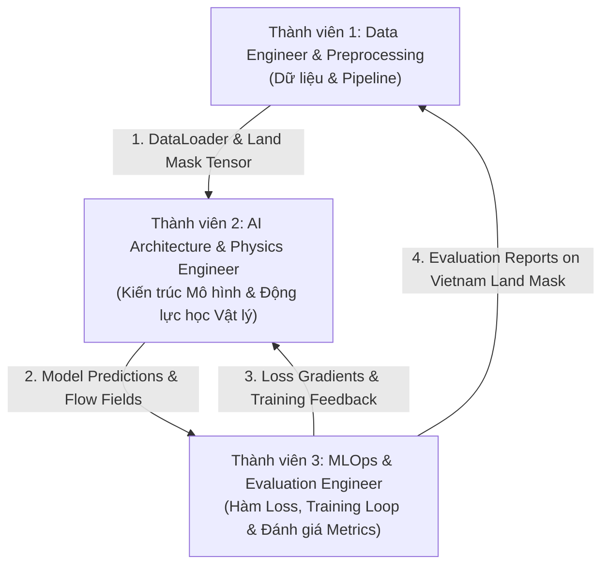

# KẾ HOẠCH PHÂN CHIA CÔNG VIỆC NHÓM 3 NGƯỜI (GIAI ĐOẠN 1)

Tài liệu này quy định việc **phân chia nhiệm vụ**, **giao diện dữ liệu chuẩn (Interface Standards)** và **lộ trình 4 tuần triển khai Giai đoạn 1** cho nhóm 3 thành viên trong bài toán Dự báo lượng mưa định lượng (PIDL Rainfall Nowcasting).

---

## 1. TỔNG QUAN PHÂN VAI VÀ LUỒNG PHỐI HỢP

---

## 2. CHI TIẾT NHIỆM VỤ TỪNG THÀNH VIÊN

### 👤 THÀNH VIÊN 1: DATA ENGINEER & PREPROCESSING
**Mục tiêu chính**: Đảm bảo toàn bộ luồng nạp dữ liệu NetCDF diễn ra nhanh chóng, chuẩn xác, tạo Tensor trọng số đất liền Việt Nam và phân chia tập dữ liệu.

| Hạng mục | Chi tiết công việc | Sản phẩm đầu ra |
| :--- | :--- | :--- |
| **PyTorch Dataset** | Viết class `IMERGDataset` đọc file `imerg_vietnam_2023_2024.nc`, thực hiện trượt cửa sổ **Sliding Window** (Input: 6 frames $t-150 \rightarrow t$, Target: 4 frames $t+30 \rightarrow t+120$). | `dataset.py` |
| **Tiền xử lý & Chuẩn hóa** | Viết module chuyển đổi `LogTransform` ($y = \log(1+x)$) và `InverseLogTransform` để đưa lượng mưa về miền giá trị mịn, xử lý clipping $[0, 50\text{ mm/30 min}]$. | `transforms.py` |
| **Vietnam Land Mask** | Chồng Polygon ranh giới Việt Nam (từ GeoPandas/Natural Earth) lên grid $165 \times 80$. Tạo ma trận Tensor `W_land` ($2.5$ cho đất liền, $1.0$ cho biển). | `land_mask.pt` |
| **Data Split** | Phân chia tập dữ liệu: Train (`2023-01-01` $\rightarrow$ `2024-06-30`) và Validation (`2024-07-01` $\rightarrow$ `2024-12-31`). | `get_dataloaders()` |

---

### 👤 THÀNH VIÊN 2: AI ARCHITECTURE & PHYSICS ENGINEER
**Mục tiêu chính**: Xây dựng toàn bộ kiến trúc mô hình Deep Learning ($M_\phi, G_\theta, D$) và tích hợp các toán tử vi phân vật lý (Burgers' Equation 2D & Warping).

| Hạng mục | Chi tiết công việc | Sản phẩm đầu ra |
| :--- | :--- | :--- |
| **Motion Extraction ($M_\phi$)** | Lập trình mạng `MotionExtractionUNet` suy diễn trường vận tốc ban đầu $V_t = (u_t, v_t)$ từ 2 frame lượng mưa liên tiếp $R_t, R_{t-1}$. | `models/motion_unet.py` |
| **Burgers' Eq Recurrence** | Lập trình module `BurgersUpdate2D`: Dùng toán tử vi phân chênh lệch hữu hạn (Finite Difference) suy diễn trường vận tốc tương lai $V_{t+1:t+4}$. | `models/burgers_module.py` |
| **Generator ($G_\theta$)** | Xây dựng module `BilinearWarping2D` uốn nắn feature map theo vận tốc $V_t$, kết hợp `MotionGuidedConvGRU` / `Swin3D` + `AxialAttention`. | `models/generator.py` |
| **Discriminator ($D$)** | Lập trình `PatchGAN Discriminator` 3D (Spatial-Temporal) đánh giá độ nét và tính chân thực của chuỗi 4 frame dự báo. | `models/discriminator.py` |

---

### 👤 THÀNH VIÊN 3: MLOPS & EVALUATION ENGINEER
**Mục tiêu chính**: Xây dựng bộ hàm mất mát hỗn hợp (Composite Losses), lập trình Engine huấn luyện tự động và Module đo đạc chỉ số khí tượng chuẩn SOTA.

| Hạng mục | Chi tiết công việc | Sản phẩm đầu ra |
| :--- | :--- | :--- |
| **Custom Loss Functions** | • **Physics Loss ($\mathcal{L}_{\text{physics}}$)**: Phương trình Advection-Diffusion 2D với trọng số $p$. • **Velocity Loss ($\mathcal{L}_{\text{velocity}}$)**: Horn-Schunck mượt vận tốc. • **Multi-Threshold Focal Loss ($\mathcal{L}_{\text{MTF}}$)**: Cross-Entropy 4 bin cường độ EDA. • **Vietnam Land-Weighted L1**: Kết hợp trọng số $W_{\text{land}}$. | `losses/composite_loss.py` |
| **Training Engine** | Viết script `train.py`: Quản lý lặp Epoch, Mixed Precision (`torch.cuda.amp`), Save/Load Checkpoint, TensorBoard/WandB logging. | `train.py` |
| **Evaluation Metrics** | Viết module đo đạc các chỉ số: **MSE, MAE, SSIM**, và **CSI** tại các ngưỡng $\text{CSI}(0.1)$, $\text{CSI}(2.5)$, $\text{CSI}(10.0)$, **POD, FAR** (đo riêng cho đất liền VN). | `metrics.py` & `evaluate.py` |

---

## 3. CHUẨN GIAO DIỆN DỮ LIỆU & QUY TẮC MÃ NGUỒN (INTERFACE AGREEMENT)

Để tránh xung đột code khi hợp nhất (merge), các thành viên phải tuân thủ đúng chuẩn Tensor sau:

1. **Input Tensor (Data Pipeline $\rightarrow$ Model)**:
   * Shape: `(B, 6, 165, 80, 1)` với dtype `torch.float32`.
   * Giá trị đã qua biến đổi Log Transform: $y = \log(1 + x)$.
2. **Output Prediction Tensor (Model $\rightarrow$ Loss/Metrics)**:
   * Shape: `(B, 4, 165, 80, 1)` đại diện 4 timestep tương lai.
3. **Velocity Tensor (Motion Module $\rightarrow$ Physics Loss)**:
   * Shape: `(B, 4, 2, 165, 80)` với Kênh 0 là $u$ (ngang) và Kênh 1 là $v$ (dọc).
4. **Quy tắc Git Branching**:
   * `feature/data-pipeline` (Thành viên 1)
   * `feature/model-architecture` (Thành viên 2)
   * `feature/training-metrics` (Thành viên 3)

---

